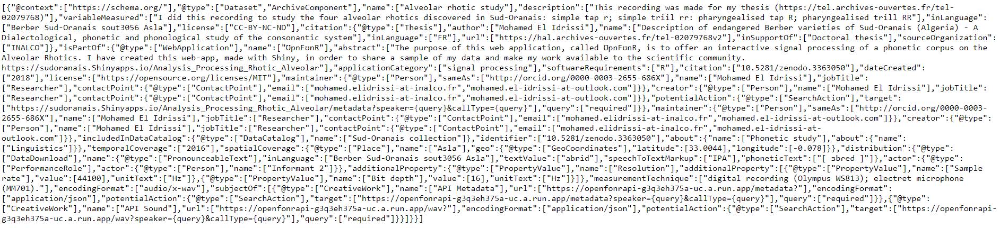

# OpenFonR_API

OpenFonR_API is a microservice used to share open research data. It puts at the disposal of the users a collection of data that can be viewed in OpenFonR ([Click here](https://sudoranais.shinyapps.io/Analysis_Processing_Rhotic_Alveolar/). The user can get recordings, annotations and metadata on Sud-Oranais Berber varieties to study the sound system of this language. 

Three endpoints are proposed: wav, label and metadata. The endpoint *wav* allows us to obtain a raw audio format, *label* provides annotations describing phonetic details of a specific audio item and *metadata* gives all the meta-information about the files. Two URL parameters, *speaker* and *callType*, should be added to query the dataset. The parameter *speaker* corresponds to the informant who elicited the items, whereas, *callType* refers to particuliar item.

A prototype is available at: https://apiopenfonr-g3q3eh375a-uc.a.run.app. To run an example, put the following address in your web browser: https://apiopenfonr-g3q3eh375a-uc.a.run.app/metadata?speaker=informant_2&callType=abrid. All the outputs returned are in JSON format.

